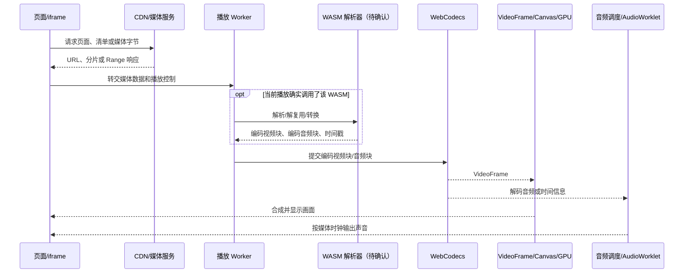

# 抖音网页播放原理与授权下载测试方法

> 文档日期：2026-09-15
> 适用范围：基于用户提供的两张 Chrome DevTools 截图，以及 Media Security Lab 仓库中的实现，对单个、公开且已获授权的播放页面进行技术分析和防护验证。本文不把截图之外的推测写成已确认事实，也不提供登录、验证码、DRM 或第三方内容保护绕过方法。

## 1. 先给出结论

从截图可以确认，页面加载了多个 WebAssembly 模块，并且播放期间存在名称包含 `webcodecs-flv-player` 的 Worker、线程池、`VideoFrameCompositor`、音频工作线程和 GPU 活动。这组证据支持以下判断：该页面至少加载了一套可能由 Worker、WASM 和 WebCodecs 参与的媒体处理链路。

截图本身不能证明 `index_v2.wasm`、`decoder.wasm` 或 `decoder_1656041798666.wasm` 一定承担当前主视频的解码，也不能证明页面只使用这一条播放链路。要确认 WASM 的实际职责，还需要把具体 WASM 实例、调用栈、导入导出、Worker 消息和对应媒体请求关联到同一个播放时间段。页面也可能按浏览器能力、编码格式、清晰度或实验分组，在 WebCodecs、自研 Worker 管线、MSE 和浏览器原生 `<video>` 管线之间切换。

对数据安全而言，最关键的结论是：只要浏览器获得了可解码的完整媒体字节，就不存在只依赖前端代码、`blob:` URL、WASM 或音视频分离便能绝对阻止复制的办法。真正有效的控制必须由服务端在清单、分片或每次 Range 请求上执行；高价值内容还应结合 DRM、许可证策略和逐用户取证水印。

## 2. 证据等级

本文使用三个证据等级：

| 等级 | 含义 | 本次示例 |
| --- | --- | --- |
| 直接观察 | 截图中可以直接读到，不需要解释才能成立 | Network 中出现三个 `.wasm`；Performance 中出现名为 `webcodecs-flv-player-0.0.2-alpha.93-2026090201` 的 Worker |
| 有依据的推断 | 多条观察与浏览器机制一致，但仍需要运行时关联才能确认 | Worker 很可能参与媒体解析、解复用或解码调度；GPU 很可能参与视频帧合成 |
| 尚未证明 | 不能仅凭截图确认 | 三个 WASM 的具体功能；主视频是否完全由 WASM 解码；当前媒体究竟通过 MSE 还是自绘 WebCodecs 管线播放；实际源文件格式和访问控制强度 |

分析报告必须保留这种分层。出现模块名、线程名或 `blob:` 地址只能形成线索，不能单独形成“已使用某技术”或“无法下载”的最终结论。

## 3. MP4、M3U8 与“播放架构”不是同一层概念

常见术语分属不同层：

| 名称 | 所在层 | 作用 |
| --- | --- | --- |
| MP4 / fragmented MP4 | 容器 | 保存或分片承载编码后的音视频样本、时间戳和索引；既可整文件传输，也可通过 HTTP Range 或流媒体分片传输 |
| WebM | 容器 | 常承载 VP8、VP9、AV1、Opus 等编码，也可拆分音视频轨 |
| FLV | 容器/流格式 | 可由 JavaScript 或 WASM 解析，再送给 MSE 或 WebCodecs；文件扩展名不一定出现在最终请求 URL 中 |
| M3U8 | HLS 播放清单 | 描述清晰度、音频组、初始化段、媒体分片、时长、字节范围及可能的加密声明；它不是视频数据本身 |
| MPD | DASH 播放清单 | 描述 Representation、音视频 AdaptationSet、初始化段和分片时间线；它也不是媒体文件本身 |
| HTTP Range | 传输方式 | 客户端通过 `Range: bytes=start-end` 获取同一资源的局部字节，服务端通常以 206 和 `Content-Range` 响应 |
| MSE | 浏览器装载接口 | JavaScript 创建 `MediaSource`/`SourceBuffer`，把分片字节追加给浏览器媒体管线 |
| WebCodecs | 浏览器编解码接口 | JavaScript/Worker 直接向浏览器解码器提交编码块，并取得 `VideoFrame` 或音频数据 |
| WebAssembly | 执行格式 | 加速解析、解复用、格式转换、校验或软件编解码等计算；它本身不是视频协议或容器 |
| `blob:` URL | 页面内对象引用 | 指向当前页面进程中的 Blob 或 MediaSource 对象；通常不是可直接由外部 HTTP 客户端请求的源媒体 URL |

因此，同一个播放页面可能同时出现“MP4 分片 + HTTP Range + Worker + WASM 解复用 + WebCodecs 解码”，也可能是“M3U8 + fMP4 分片 + MSE + 原生 `<video>`”。只看到 MP4 或 M3U8，不能推出完整播放架构；只看到 WASM，也不能推出媒体的实际传输方式。

除 MP4/M3U8 外，网页还常见 DASH/MPD、WebM、MPEG-TS、FLV、CMAF/fMP4、直接 HTTP 字节流以及低延迟场景中的 WebRTC。每种形式仍要进一步区分“地址发现、媒体解析、解码、同步、渲染、鉴权”这些环节。

## 4. 本次截图说明了什么

### 4.1 直接观察到的内容

第一张 Network 截图显示页面请求过：

- `index_v2.wasm`
- `decoder.wasm`
- `decoder_1656041798666.wasm`

第二张 Performance 截图显示：

- 主页面为抖音网页播放页面；
- 存在 iframe；
- 存在普通 Worker；
- 至少两条 Worker 轨道的名称包含 `webcodecs-flv-player-0.0.2-alpha.93-2026090201`；
- 线程池持续活动；
- `Media`、`VideoFrameCompositor`、`Realtime AudioWorklet thread` 和 GPU 轨道存在活动；
- 页面连续产生视频画面帧，主线程没有持续被长任务占满。

### 4.2 有依据的推断

Worker 名称同时包含 `webcodecs`、`flv` 和 `player`，所以它很可能属于一套在 Worker 中处理 FLV 或类 FLV 媒体、调用 WebCodecs 的播放器实现。线程池活动可能来自 WASM 线程、Chromium 媒体线程或其他并行任务；`VideoFrameCompositor` 与 GPU 活动符合解码帧被合成和显示的特征；AudioWorklet 活动符合独立音频调度或处理的特征。

一种与这些证据相符的候选链路是：



另一条可能同时存在或作为降级路径使用的链路是：页面获取媒体分片，JavaScript 将其追加到 `MediaSource` 的音频/视频 `SourceBuffer`，随后由 `<video>` 元素和 Chromium 原生媒体管线负责解复用、解码、同步和渲染。

### 4.3 截图不能证明的内容及补证方式

| 未确认问题 | 需要的补充证据 |
| --- | --- |
| 哪个 WASM 负责主视频 | 在 Sources/Performance 中把 WASM 函数调用、Worker 消息和当前视频请求按时间关联；查看模块导入导出和调用栈 |
| WASM 是解码器还是解析器 | 检查它的输入输出：输入是压缩媒体、NAL/packet、还是其他业务数据；确认是否直接调用 VideoDecoder/AudioDecoder |
| 当前页面使用 WebCodecs 还是 MSE | 捕获 `VideoDecoder.configure/decode`，并同时观察 `MediaSource.addSourceBuffer/appendBuffer`；比较哪条链路在播放时间段持续产生活动 |
| 视频源是 MP4、FLV、HLS 还是 DASH | 检查响应 MIME、文件头、清单内容、`Content-Range` 和分片关系，不能只看 URL 后缀 |
| 音视频是否分离 | 关联独立的 `video/*`、`audio/*` 请求、编码信息、时长和时间基；最终用 ffprobe 验证每个下载物的流结构 |
| 是否存在有效下载限制 | 使用授权的、小范围探针和显式完整下载验证，检查服务器是否在每次请求上执行鉴权 |

## 5. 为什么视频和音频经常分开

将视频与音频作为独立 Representation/轨道传输，通常有以下收益：

- **自适应码率**：网络变差时只切换视频清晰度，音频可以保持稳定；
- **编码独立**：同一视频可以组合不同音频编码、声道或语言；
- **缓存与 CDN 复用**：一条音频轨可以与多个视频清晰度组合，减少重复存储和传输；
- **带宽控制**：播放器分别选择视频码率和音频码率；
- **定位和预取**：可根据缓冲状态独立请求某一轨的分片；
- **生产流程**：转码、封装和内容分发可以分别处理多个视频版本和音轨。

播放时，用户看到的是一个逻辑播放器，而不是两个互不相关的播放器各自随意启动。同步依靠每个媒体样本的 PTS/DTS、timebase、起始时间和统一媒体时钟：

- 在 MSE 路径中，可使用同一 MediaSource 下的音频和视频 SourceBuffer，由浏览器依据时间戳同步；
- 在 WebCodecs 路径中，播放器取得解码后的 `VideoFrame` 和音频数据后，以音频时钟或统一播放时钟调度帧；
- 如果轨道的时长、起始时间、时间基或内容身份不能对齐，就不能仅凭“同时被页面请求”自动配对。

[媒体关联器](../src/main/media/media-correlator.ts)因此只在存在相同捕获身份、明确的 MSE 对象关系或稳定内容身份时配对候选轨，并把置信度和依据一并输出。时间接近只能辅助分析，不能单独证明两条轨属于同一内容。

## 6. `blob:` 数据是不是已经合并的音视频

不一定。`blob:` URL 只是页面内对象的引用，常见两种情况：

1. 指向普通 Blob。Blob 内可以是完整文件、单轨数据、一个分片或任意二进制内容；
2. 指向 MediaSource。此时 URL 只是 `<video>` 与 MediaSource 的连接点，真正的媒体字节由 JavaScript 后续追加到一个或多个 SourceBuffer。

因此，从 `<video src="blob:...">` 不能推出该对象是一个可保存的、已经合并好的 MP4。视频和音频可能分别追加，也可能是复合片段；真正源 URL 通常要从 Network、Worker fetch、清单或请求初始化数据中寻找。

[MSE 注入器](../src/main/browser/mse-instrumentation.ts)只记录：

- `URL.createObjectURL` 产生的对象标识；
- `MediaSource.addSourceBuffer` 的 MIME/codec 字符串；
- `SourceBuffer.appendBuffer` 的字节数和追加后的 buffered 时间范围。

它不复制 SourceBuffer 内容，也不把 `blob:` 当作远程下载地址。这能建立播放证据，同时避免把页面中的大量原始媒体缓冲区写入日志。

## 7. CDP、页面、iframe、Worker 和 MSE 捕获分别做什么

| 观察面 | 作用 | 能回答的问题 | 局限 |
| --- | --- | --- | --- |
| 页面 Page/Network | 观察导航、生命周期、主页面发起的请求和响应元数据 | 页面加载了什么；请求是否为 200/206；MIME、长度、Range、缓存情况 | 页面脚本可把实际请求移到 iframe 或 Worker；仅有请求名不能证明用途 |
| iframe/frame | 把嵌入播放器或跨域框架的请求归属到具体 frame | 哪个 frame 触发媒体；父子导航关系 | 跨域和进程切换会增加关联难度；同 URL 在不同 frame 中不是同一个请求实例 |
| Worker/Service Worker | 捕获 Worker 发起的网络活动与目标生命周期 | 媒体是否在后台请求、解析或缓存；Service Worker 是否返回响应 | 只能观察到暴露给 CDP 的事件；Worker 名称不是功能证明；早期请求可能受附加时机影响 |
| MSE 元数据 | 观察对象 URL、SourceBuffer MIME、append 大小和 buffered 范围 | 页面是否把哪些 MIME 的字节追加到哪个媒体对象 | 这是尽力而为的页面注入，不是可信安全预言机；不能读取解密密钥，也不保存媒体负载 |
| Media 域 | 获取 Chromium 可提供的播放器属性和事件 | 浏览器媒体管线是否创建播放器、发生错误或状态变化 | 不同 Chromium 版本和播放路径支持度不同 |
| Runtime | 安装只读绑定和 MSE 观测脚本，记录执行上下文 | 哪个执行上下文产生 MSE 事件 | 执行上下文可能销毁或重建；注入失败只能标记捕获不完整 |

[CDP 捕获器](../src/main/browser/cdp-capture.ts)使用 `Target.setAutoAttach` 连接页面及目标，启用 Network、Runtime、Page 和 Media 域，并为每个请求建立 `runId + targetId + sessionId + frameId + requestId + version` 的不可变来源身份。这样可避免把同名 URL、重定向前后或不同 Worker 中的请求误当成同一个来源。

[隔离浏览器控制器](../src/main/browser/browser-controller.ts)在独立 Electron Session 和沙箱化 WebContentsView 中打开用户明确输入的一个 URL，关闭 Node 集成、权限、弹窗、webview 和浏览器下载入口。这里的目标是可控观察，不是给目标页面文件系统或产品 IPC 权限。

## 8. Media Security Lab 的授权测试流程

完整约束见[设计规格](superpowers/specs/2026-09-15-media-security-lab-design.md)和[实现计划](superpowers/plans/2026-09-15-media-security-lab-implementation.md)。当前主进程接口及服务已按以下顺序组织；完整可视工作台是该流程的界面契约。若使用的是仍显示“启动自检”页的过渡构建，应以主进程服务和测试结果为准，等待可视工作台构建完成后再按界面步骤操作。

### 8.1 前置条件

- 每次只输入一个明确页面 URL；
- 页面必须公开、无需登录；
- 用户必须确认自己拥有该资产或已获授权测试；
- 先选择输出目录；
- 最大并发只能为 1–4，默认 4；
- 选择“只观察”“标准安全验证”或“完整下载验证”；
- 只有“完整下载验证”模式允许完整取回媒体。

这些输入由[共享 Zod 校验](../src/shared/schemas.ts)约束，渲染层通过[窄化 preload API](../src/preload/index.ts)调用主进程。目标页面没有产品 IPC 权限。

### 8.2 页面观察与来源识别

1. `chooseOutputDirectory()` 选择并固定输出目录；
2. `startRun()` 创建运行、隔离浏览器、CDP 捕获和取消信号；
3. 页面、iframe、Worker、Service Worker、Network 和 MSE 只产生结构化观察；
4. URL、Cookie、Authorization、签名和令牌在持久化与界面边界被脱敏；
5. 原始 URL/请求头只保留在当前主进程运行内存中，供同一请求实例的授权重放使用；运行结束或取消后不再依赖这份临时能力；
6. 关联器根据 MIME、206/Range、容器线索、MSE MIME、内容身份和捕获身份形成媒体资产及候选轨；
7. 加密、失败或不完整的轨道不会自动进入可下载集合。

原始与脱敏数据的分离由[运行编排器](../src/main/runs/run-orchestrator.ts)、[捕获器](../src/main/browser/cdp-capture.ts)和[脱敏规则](../src/main/security/redact.ts)共同执行。SQLite 和普通报告只接收脱敏结果。

### 8.3 有界安全探针

`finishObservation()` 停止页面观察并进入探测阶段。自动工作台使用[探针计划](../src/main/probes/probe-planner.ts)和[HTTP 传输器](../src/main/probes/http-transport.ts)，只从已经观察到且属于所选轨道的 GET 请求生成变体，不猜测新 ID、不遍历站点。

一般探针只读取最多 4096 字节。它会比较状态码、Content-Type、Content-Range、Content-Length、实际字节数、样本 SHA-256 和媒体文件头结构。非头部 Range 只有在同一精确来源的头部已被结构识别后，才可以被标记为“linked-range”媒体证据。

Range 覆盖包含文件头、第二个连续小区间（有限并发计划中的 `4096-8191`）、已知总长度的中部和尾部。这样可以区分“只允许读取起始缓冲区”和“任意位置仍可访问”。第二个区间、中部和尾部本身通常没有完整容器头，所以必须与同一不可变来源实例的已识别头部证据连接，不能只凭 206 就判定为目标媒体。

若观察到 HLS 或 DASH 清单，[清单解析器](../src/main/media/playlist-parser.ts)会在固定输入和输出预算内解析 HLS 主/媒体清单、备用音频、初始化段、BYTERANGE，以及 DASH Representation、SegmentList、SegmentTimeline 和 ContentProtection。出现 `EXT-X-KEY`、DASH ContentProtection、MP4 保护 box 或 WebM ContentEncryption 时，流程只记录加密证据并停止可播放明文验证，不请求密钥或许可证。

代码中定义了 `range-full` 探针，但当前[工作台服务](../src/main/workbench-service.ts)在自动探测阶段排除该探针，以免自动流程意外读取完整响应。真正的完整取回只由用户在“完整下载验证”模式下显式调用 `startDownload()`。

### 8.4 显式下载视频轨和音频轨

完整下载必须同时满足：

- 当前运行仍然有效；
- 运行模式为 `full-download`；
- 授权确认仍为真；
- 所选轨道属于同一媒体资产，数量为 1 或 2；
- 轨道不是清单、加密轨或失败轨；
- 精确来源请求仍在当前主进程内存中；
- 该来源已经通过基线或头部短样本，获得下载授权凭据；
- 输出目录仍与用户选择时的目录对象一致。

[下载器](../src/main/download/downloader.ts)执行以下步骤：

1. 从已验证的头部响应取得总长度、ETag 和/或 Last-Modified；
2. 以 `Accept-Encoding: identity` 和顺序 Range 获取连续区间；
3. 若服务端返回比请求更小但合法的区间，从实际结束位置继续，而不是把缺口当成功；
4. 每段校验 206、Content-Range、总长度、Content-Length、版本标识和实际字节数；
5. 401/403 记为服务端拒绝；412、版本变化、忽略 Range、提前断流、长度错误或网络失败不会被解释为“防护有效”；
6. 通过[受约束输出工作区](../src/main/download/output-workspace.ts)流式写入私有临时文件，同时计算 SHA-256 并检测加密标记；
7. 每次恢复只接受从 0 开始的连续前缀、相同来源、相同长度和相同版本标识；
8. 完成后重新读取并核对长度、SHA-256 和文件身份，再原子发布最终轨道文件。

若服务器限制单次响应大小，但允许同一授权主体任意请求后续 Range，下载器仍可能通过多次连续请求取得完整内容。这说明“单次最多返回 N 字节”是限速或成本控制，不是完整的防下载策略。

### 8.5 音视频无损合并与结构验证

视频轨和音频轨分别完整下载并通过 ffprobe 后，[FFmpeg 适配器](../src/main/media/ffmpeg-adapter.ts)才允许合并。核心语义相当于在本地授权文件上执行：

```text
ffmpeg -i video-track -i audio-track \
  -map 0:v:0 -map 1:a:0 -c copy output
```

`-c copy` 表示重新封装，不重新编码。适配器还会去除来源元数据和章节，限制允许的本地协议/容器，要求：

- 视频输入恰好包含一条视频流；
- 音频输入恰好包含一条音频流；
- 两个输入容器兼容；
- 两条轨的时长在允许误差内；
- 未检测到 MP4/WebM 加密或保护元数据；
- 输出不存在，临时输出没有被替换。

合并后由 ffprobe 从头到尾读取结构并核对：容器、两条流、codec、codec tag、profile、timebase、extradata 哈希、分辨率、采样率、声道、packet 数和时长。只有输出参数与输入轨一致、媒体时长匹配且最终文件已安全发布，才标记为验证成功。相关回归用例见[FFmpeg 集成测试](../tests/integration/ffmpeg-adapter.test.ts)。

### 8.6 形成报告

[发现规则](../src/main/reports/finding-engine.ts)只接受能链接到精确来源、终态事件和结构化响应证据的探针或下载结果。[报告生成器](../src/main/reports/report-generator.ts)输出 JSON 与 Markdown；报告包在主进程内保留原始能力并在读取、导出前进行完整性校验。

报告必须区分：

- `accessible`：目标媒体字节可访问；短样本不等于已验证完整播放；
- `denied`：目标服务器对该测试变体明确返回 401/403；
- `encrypted`：发现加密或保护标记，工具停止，不尝试解密；
- `inconclusive`：网络、DNS、TLS、超时、解析、文件、FFmpeg 或其他工具问题导致无法下结论。

## 9. 如何使用 Media Security Lab 复测自己的优化

下面是实验室工作流，不适用于未获授权的第三方媒体：

1. 在自己的预发布或受控生产环境准备一个公开可播放的单页地址；
2. 打开新建测试，选择输出目录；
3. 输入该页面 URL，选择“标准安全验证”，确认授权，最大并发保持 4 或更低；
4. 开始运行，让页面实际播放一小段，使清单、首段、音视频轨、Worker 和 MSE 信号出现；
5. 点击“结束观察”，查看识别出的资产、视频轨、音频轨及配对依据；
6. 查看 Cookie、查询参数、Referer、Origin、头/中/尾 Range、有限并发和到期重放矩阵；
7. 保存基线报告；部署服务端优化；
8. 用同一测试内容、相同运行模式和相近网络条件重新运行，比较每个变体的服务端证据；
9. 只有在需要验证“是否能完整取回”时，新建“完整下载验证”运行，再由用户显式选择同一资产的视频轨和音频轨并启动下载；
10. 查看两个单轨文件的 SHA-256、连续区间和 ffprobe 结果；若两轨均完整，检查合并文件的双轨结构和时长；
11. 导出 JSON/Markdown 报告，保留优化前后的测试时间、服务端策略版本和日志关联 ID；
12. 对任何失败先判断是服务端明确拒绝，还是工具/网络异常。后者必须复测，不能计作防护通过。

工作台接口与运行状态定义在[共享契约](../src/shared/contracts.ts)，主进程调用顺序在[工作台服务](../src/main/workbench-service.ts)，IPC 的调用方、输入和输出目录约束在[IPC 路由](../src/main/ipc.ts)。

## 10. 可视工作台中每一步应如何解释

每条 RunEvent 需要回答五个问题：

| 界面字段 | 应显示的内容 | 示例 |
| --- | --- | --- |
| 准备做什么 | 即将执行的动作与范围 | “读取所选视频轨开头最多 4096 字节” |
| 为什么 | 该动作验证的安全假设 | “确认当前精确来源确实返回目标媒体，建立后续 Range 的结构基线” |
| 修改了什么 | 相比观察请求的最小变化，敏感值脱敏 | “移除 Referer；Range 改为 `bytes=0-4095`；其他可重放头保持不变” |
| 服务端返回 | 状态码、MIME、Range、长度、耗时、样本哈希或本地工具结构化结果 | “206；`video/mp4`；`bytes 0-4095/…`；4096 字节；结构头可识别” |
| 如何判定 | 规则、结论、置信度和限制 | “该变体可访问媒体头；只证明短样本可取，不证明整个文件可取” |

典型步骤展示：

- **CDP 页面/iframe/Worker**：准备附加目标；解释是为了覆盖不同请求发起上下文；显示附加结果；若失败则标记捕获不完整；
- **MSE**：准备安装元数据钩子；解释是为了关联 `blob:`、SourceBuffer MIME 和追加范围；显示对象 ID、MIME、字节数；明确不保存缓冲区；
- **探针**：展示唯一变更和服务端结果；结论只覆盖当前请求实例；
- **下载**：展示当前连续区间、总字节、重试、版本校验和哈希；缺口或版本变化即停止；
- **FFmpeg/ffprobe**：展示输入轨身份、stream-copy 进度、输出流结构；工具错误标记“不确定”；
- **报告**：展示引用的事件 ID；用户可从结论返回原始脱敏证据。

## 11. 授权测试矩阵

表中的“通过证据”指测试执行与证据链合格，不等于安全防护通过。

| 测试 | 执行方式 | 通过证据 | 失败/不确定语义 | 发现暴露后的修复方向 |
| --- | --- | --- | --- | --- |
| 基线短样本 | 用观察到的精确 GET 来源请求媒体头，最多 4096 字节 | 200/206、媒体 MIME、结构头、长度一致、样本 SHA-256 | 基线失败可能是 URL 到期、网络或工具问题；不能判安全 | 先确保测试环境和授权有效，再测其他变体 |
| 移除 Cookie | 只移除 Cookie 后重放同一来源 | 结构媒体仍可访问，说明 Cookie 不是必要控制 | 401/403 说明该变体被拒绝；其他错误不确定 | 在清单、分片和 Range 上验证会话授权，不只验证页面 |
| 移除查询参数 | 删除全部已观察查询参数 | 同一资源媒体头仍可访问，说明签名/参数可能非必要 | 301/404/解析失败不能自动证明签名有效 | 使用短期、绑定内容/清晰度/范围策略的服务端签名 |
| 移除 Referer | 只移除 Referer | 媒体仍可访问，说明 Referer 不构成必要条件 | 401/403 只证明缺失 Referer 被拒，仍需验证伪造风险 | 不把 Referer 当身份；以令牌和服务端授权为主 |
| 移除 Origin | 只移除 Origin | 后台客户端仍取得媒体字节 | 浏览器 CORS 错误与服务端鉴权是两件事 | CORS 用于浏览器跨域控制；另行实现媒体授权 |
| 头部 Range | 请求文件开头 | 206、从 0 开始、长度一致、结构可识别 | Range 被忽略或不一致为不确定/协议错误 | 对每次 Range 校验主体、资源、时效和策略 |
| 中部 Range | 请求已知总长度中部的小区间 | 206、区间精确，且与同来源结构头关联 | 未知总长度则跳过；200 只可能形成头部基线 | 若业务要求顺序播放，在服务端使用可审计窗口策略，并考虑拖动体验 |
| 尾部 Range | 请求最后 4096 字节 | 206、结束位置等于总长度减一，并与同来源头部关联 | 仅返回 200 或范围不一致不构成成功 | 阻止任意尾段访问需服务端策略，单靠前端播放进度无效 |
| 有限并发 Range | 对同一来源发起 2–4 个有界区间 | 每个响应均为同一媒体的合法区间 | 混合结果为不确定，需逐项查看 | 做主体级并发、速率、总流量和异常区间监控 |
| 到期重放 | 对可识别且等待不超过限制的过期时间重放 | 过期后目标服务明确 401/403 | 过期太远会跳过；时钟或网络错误不确定 | 缩短有效期，避免宽松时钟窗口，校验资源和会话绑定 |
| 完整轨道下载 | 仅在显式完整模式，从 0 连续取到总长度 | 无缺口、版本标识一致、最终长度与 SHA-256 一致 | 失败保留断点和原因；除明确 401/403 外均不证明安全 | 在每段/Range 执行授权，限制重放与异常获取，同时保持合法播放可用 |
| 加密/DRM 检测 | 检查清单、响应和 MP4/WebM 保护元数据 | 发现保护标记后停止，不产生“可播放明文” | 只看到标记不证明许可证策略安全 | 单独验证许可证服务、设备策略、密钥轮换和撤销能力 |
| 音视频合并 | 两条完整、同资产、时长匹配的单轨进行 stream copy | ffprobe 验证双轨、codec 参数和时长均一致 | FFmpeg/文件错误属于本地不确定 | 若不希望明文轨可重组，应使用端到端 DRM；分轨本身不是安全边界 |

探针集成行为可参考[探针测试](../tests/integration/probe-runner.test.ts)，顺序下载、断点和完整性行为可参考[下载测试](../tests/integration/downloader.test.ts)。

## 12. “不播放完就不能完整下载”为什么不成立

播放器是否已经显示完整视频，与服务器是否允许取得完整字节是两个不同状态。以下任一情况成立时，即使用户只播放了几秒，授权客户端也可能取得完整内容：

- 媒体 URL 在一段时间内稳定有效；
- 同一凭据允许请求任意 Range；
- 清单已经暴露全部分片地址，且每个分片使用相同或可重放的令牌；
- 服务器只限制单次响应大小，但不限制连续请求；
- 音视频虽分离，但两个轨道都可独立完整访问。

“按播放进度签发短窗口分片”可以提高批量获取成本，但仍要在每个分片上由服务端验证窗口、会话和资源，并处理预取、重试、拖动、多端、弱网和时钟误差。客户端会提前缓冲，服务端不能简单把“请求到了尚未显示的位置”全部视为攻击。

即使服务端把合法客户端严格限制为实时播放，获得明文帧和音频的授权终端仍可能进行屏幕录制、音频回采或内存层捕获。因此防护目标应写成可衡量的风险降低，例如：防止匿名批量抓取、缩短链接重放时间、限制账号级异常流量、让泄露可追踪，而不是承诺“无法下载”。

## 13. 防护设计建议

| 控制 | 建议 | 不能解决的问题 |
| --- | --- | --- |
| 内容绑定的短期签名 URL | 签名包含内容 ID、轨道/清晰度、到期时间、允许动作及服务端版本；密钥轮换；失败返回一致 | 合法终端仍会得到媒体字节；过短会伤害弱网和重试 |
| 清单、分片和 Range 全链路授权 | 不只保护页面或主清单；每个媒体请求都验证主体、资源和时效 | 实现复杂，需兼顾 CDN 缓存命中与回源成本 |
| 会话/设备/风险绑定 | 绑定稳定会话或设备证明，并允许合理迁移和恢复；避免仅绑易伪造头 | IP 变化、共享网络、隐私限制和设备更换会导致误伤 |
| nonce/重放控制 | 对一次性授权或分片窗口记录已用 nonce、序列或滑动窗口；只在业务允许时使用 | CDN 离线缓存和并行预取需要特别设计，不能机械要求严格单次 |
| 速率、并发和总流量策略 | 按账号、设备、会话和内容聚合；识别大量离散 Range、过快完整覆盖和异常并发 | 只能提高成本和发现异常，不能证明内容不会泄露 |
| 分片窗口 | 只签发合理播放窗口内的分片，允许有限预取、拖动与重试 | 被授权播放的窗口仍可保存；复杂窗口容易影响体验 |
| CORS | 限制网页脚本跨域读取，缩小浏览器攻击面 | 非浏览器 HTTP 客户端不受 CORS 保护，因此不是下载授权 |
| Referer/Origin 检查 | 作为低权重风控信号或 CSRF 辅助信号 | Referer 可缺失或伪造，Origin 也不是用户身份；不能作为唯一门槛 |
| DRM | 对高价值内容使用成熟 DRM、许可证授权、输出保护和密钥轮换 | 不能阻止所有屏幕录制；成本、平台兼容性和许可证可用性需评估 |
| 逐用户取证水印 | 在画面或编码层嵌入可归因标识，并保护映射数据 | 不阻止获取本身；需要抗裁剪、串谋和误归因设计 |
| 日志和告警 | 记录匿名化主体、内容、授权版本、Range 覆盖率、拒绝原因和风险分数；建立处置闭环 | 日志本身不阻断，需要运营响应和隐私治理 |

修复验收应以服务端证据为准。例如，移除查询参数后明确 401/403，且保持原签名的基线请求仍能访问，才支持“查询签名为必要条件”；一次 TLS 超时不能支持这个结论。若限制只让下载更慢但连续区间最终仍能覆盖整个文件，报告应写“降低获取速度”，不能写“阻止下载”。

## 14. 安全边界与局限

- 只测试自己拥有或已书面授权的资产；
- 每次运行只处理一个用户明确输入的页面及其直接产生的媒体请求；
- 不搜索站点、不遍历页面、不枚举视频 ID；
- 不导入登录 Cookie，不收集账号凭据，不处理验证码；
- 不绕过登录、会话或服务端入侵防护；
- 不获取许可证、密钥资源，不提取密钥，不绕过 DRM；
- 发现加密时只记录标记并停止可播放明文输出；
- 不把 `blob:`、CORS、Referer、音视频分离、WASM 混淆或单次响应上限当作可靠安全边界；
- 页面、浏览器、目标站点和 CDN 更新可能改变捕获结果；
- 工具不支持某种容器、协议或浏览器路径时，结果是“不确定”，不是“安全”；
- 短样本可访问只证明该样本可访问；完整下载成功才证明测试时、该精确来源和授权上下文下可以完整取回；
- 完整下载失败也只覆盖本测试矩阵，不能证明不存在其他合法或非法获取路径。

通过这套方法，优化目标可以从模糊的“让视频不能下载”改为可验证的控制：未授权请求在每一个媒体入口被拒绝；链接重放窗口足够短；异常 Range 覆盖可被限制和告警；高价值内容由 DRM 保护；已授权终端泄露可通过取证水印追踪；任何测试异常都不会被误报为防护成功。
